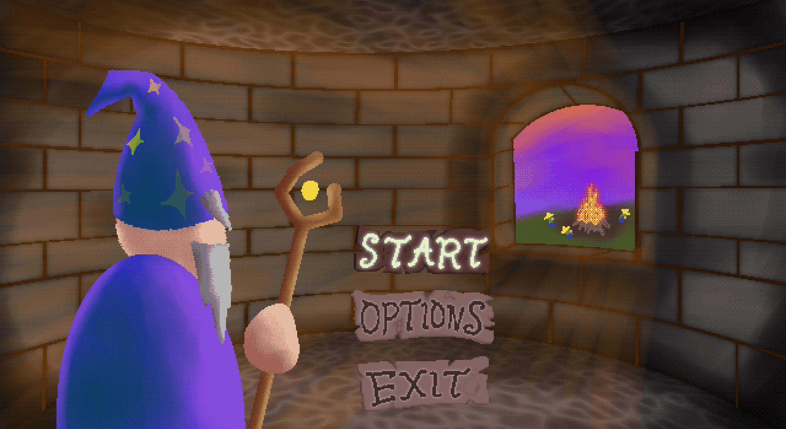
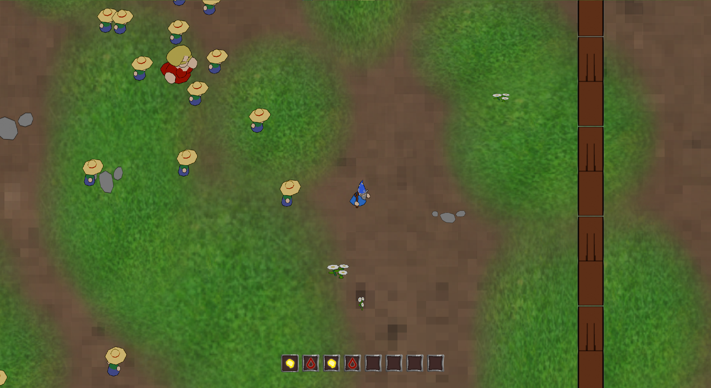
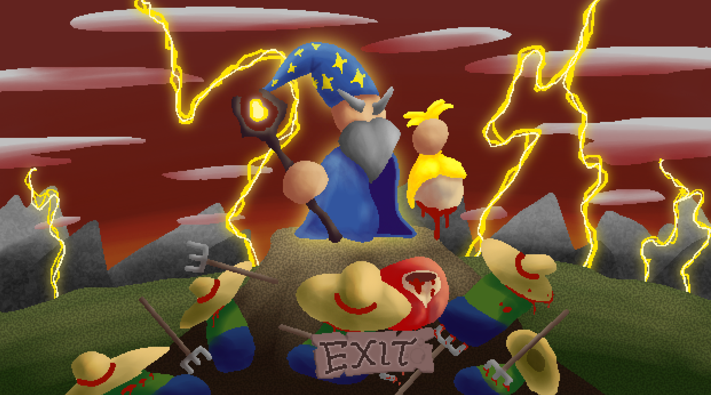

# Gamejam 09_08_24

This was my, @Eivindaj and @JayJayDev's gamejam from 09.08.24-11.08.24

Gamejam was concluded with commit 03862d7f766626f268c791e2ae33baaccea6d656 ([release](https://github.com/Avokadoen/gamejam_09_08_24/releases/tag/0.0.1)), but some commits have been pushed after to make the game more enjoyable to play.

We wanted to make something inspired by binding of isaac. The game is built with the [zig programming language (v0.13.0)](https://ziglang.org/),
[raylib](https://www.raylib.com/) using [raylib-zig](https://github.com/Not-Nik/raylib-zig) as our bindings for zig.

It also uses my ecs library [ecez](https://github.com/Avokadoen/ecez) for the game logic. 

# How to run

You must have git and zig 0.13.0 to run this project.

```
git clone https://github.com/Avokadoen/gamejam_09_08_24
cd gamejam_09_08_24
zig build run
```

# Game rules

## Input 

wasd to move arrows to shoot
tab to open a inventory that does nothing

## Inventory and spells 

wizard is equipped with the only staff in the game which is slotted with two spells where one of the spells is using a piercing and added damage modifier (this was supposed to be customizable in the inventory :') ).

## Win condition 

Killing 100 farmers will spawn the farmers wife. I don't think she is happy you have already killed 100 of her husbands!
Killing the farmers wife will give you the victory screen, good job, you monster!

# Screenshots

## Main Menu


## Ingame



## Victory 



# AI assets

Assets listed here are made by AI, and not us. 
 
 - resources\music\Gameplay_Loop.wav
